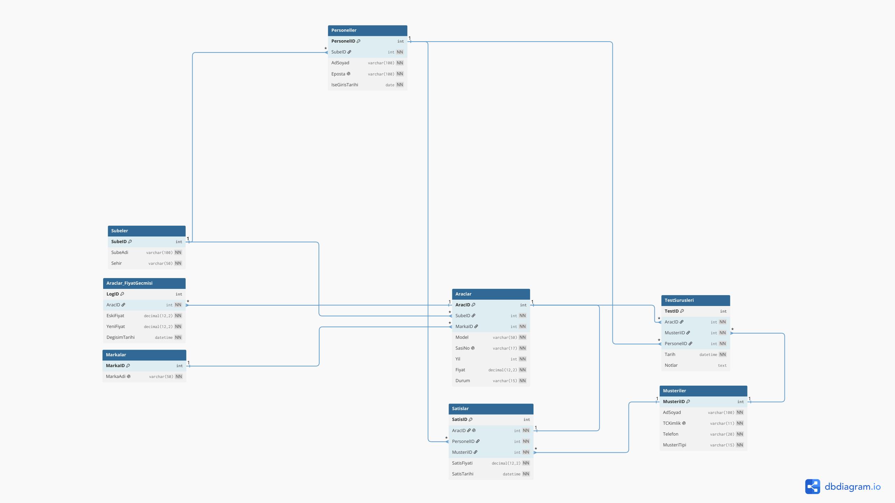
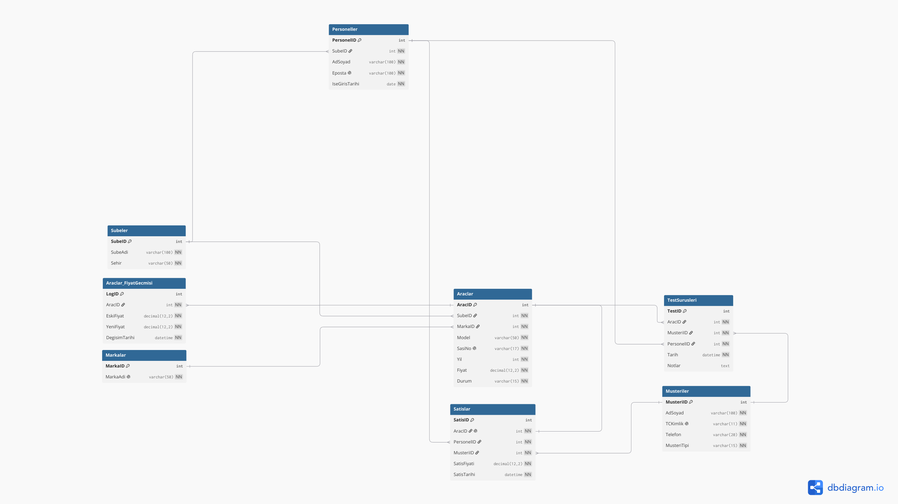
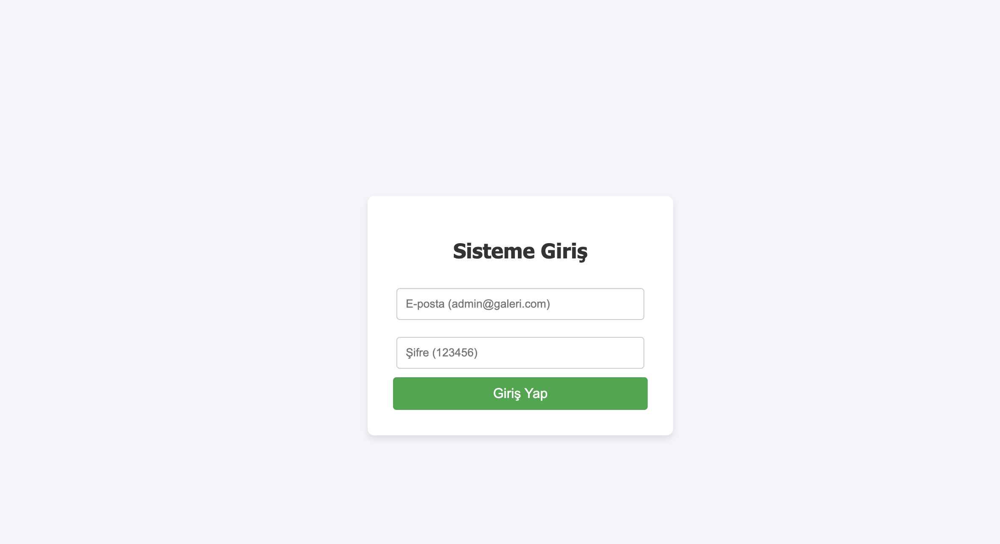

README

# 🚗 OtogaleriDB — Oto Galeri Yönetim Sistemi

> **TBL331 Veritabanı Yönetim Sistemleri | 2025-2026 Bahar Dönemi**
> **Kocaeli Üniversitesi — Bilişim Sistemleri Mühendisliği**

Çok şubeli bir oto galeri zincirinin tüm operasyonlarını yöneten, **web ve mobil arayüze** sahip, MySQL tabanlı uçtan uca bir veritabanı yönetim sistemidir. Sistem; araç stoğu, müşteri kayıtları, test sürüşleri, satış işlemleri ve personel yönetimini tek merkezde toplar.

---

## 👥 Ekip

| Ad Soyad | GitHub | Sorumluluk Alanı |
|----------|--------|------------------|
| Furkan Ocak | [@furkanocak1](https://github.com/furkanocak1) | Web Frontend, Mobil Uygulama (Flutter) |
| Magomedkamil Kamilov | [@GambitKamil](https://github.com/GambitKamil) | Veritabanı Tasarımı, Backend API (PHP) |
| Cüneyt Şendur | [@cuneytsendurr](https://github.com/cuneytsendurr) |Backend API (PHP) |

---

## 📑 İçindekiler

1. [Proje Özeti ve Genel Yapı](#-1-proje-özeti-ve-genel-yapı)
2. [Problem Tanımı](#-2-problem-tanımı)
3. [Geliştirme Ortamı](#-3-geliştirme-ortamı)
4. [Yazılım Mimarisi](#-4-yazılım-mimarisi)
5. [Veritabanı Diyagramı (ER)](#-5-veritabanı-diyagramı-er)
6. [Veritabanı Bileşenleri](#-6-veritabanı-bileşenleri)
7. [Akış Şeması](#-7-akış-şeması)
8. [Kurulum](#-8-kurulum)
9. [Çalıştırma](#-9-çalıştırma)
10. [Ekran Görüntüleri](#-10-ekran-görüntüleri)
11. [Yapılan Araştırmalar](#-11-yapılan-araştırmalar)
12. [Proje Durumu](#-12-proje-durumu)
13. [Referanslar](#-13-referanslar)

---

## 🎯 1. Proje Özeti ve Genel Yapı

**OtogaleriDB**, oto galeri zincirleri için tasarlanmış kapsamlı bir yönetim sistemidir. Proje, **3 katmanlı (3-tier) mimari** üzerine inşa edilmiş olup, **veri katmanı (MySQL)**, **uygulama katmanı (PHP API)** ve **sunum katmanı (Web + Flutter Mobil)** olmak üzere üç ayrı bileşenden oluşmaktadır [1] [4].

**Sistemin genel yapısı şu şekildedir:**

- **Veritabanı katmanı:** 7 ana tablo + 1 audit tablosu, 5 farklı kısıtlayıcı türü, 5 index, 4 view, 3 trigger ve 4 stored procedure içerir. Veritabanı, 5N (normalizasyon) kurallarına uygun olarak tasarlanmıştır [4].
- **Backend katmanı:** PHP'nin PDO eklentisi kullanılarak geliştirilmiş RESTful tarzında bir API olup, web ve mobil istemcilerden gelen istekleri JSON formatında karşılar [2].
- **Web katmanı:** PHP + HTML + CSS + JavaScript ile geliştirilmiş, çoklu sayfa yapısına sahip yönetim panelidir.
- **Mobil katmanı:** Flutter framework'ü kullanılarak geliştirilmiş, tek bir kod tabanından hem iOS hem Android hem de web platformlarında çalışan uygulamadır [3].

**Sistemin başlıca işlevleri:**
- Çoklu şube yönetimi
- Araç stok takibi (Satışta / Satıldı / Rezerve)
- Bireysel ve kurumsal müşteri kayıtları
- Test sürüşü randevu sistemi
- Satış işlemi otomasyonu
- Personel performans takibi
- Şube bazlı stok ve değer raporları
- Fiyat değişiklik geçmişi (audit trail)

İş mantığının önemli bir kısmı **veritabanı seviyesinde** (Trigger + Stored Procedure ile) uygulanmıştır. Bu yaklaşım, uygulama katmanından bağımsız veri bütünlüğü sağlar [1] [6].

---

## ❗ 2. Problem Tanımı

Modern oto galerileri, çoklu şube operasyonlarında çeşitli yönetimsel zorluklarla karşılaşmaktadır:

**2.1 Stok Yönetimi Karmaşası**
Birden fazla şubede bulunan onlarca aracın durumlarını (satışta, satıldı, rezerve) manuel takip etmek imkansızdır. Excel tabloları veya kağıt kayıtlar tutarsızlığa, mükerrer kayıtlara ve veri kaybına yol açar.

**2.2 Müşteri Verisi Dağınıklığı**
Bireysel ve kurumsal müşterilerin bilgileri farklı dosyalarda tutulduğunda, aynı müşterinin TC kimlik numarasıyla iki kez kaydedilmesi, telefon numarası tutarsızlıkları gibi sorunlar oluşur.

**2.3 Test Sürüşü Çakışmaları**
Satılmış bir araç için yanlışlıkla yeni bir test sürüşü randevusu verilmesi, hem müşteri memnuniyetsizliğine hem de operasyonel hatalara yol açar.

**2.4 Satış Süreci Tutarsızlıkları**
Bir araç satıldıktan sonra stok durumunun "Satıldı" olarak güncellenmesinin unutulması, raporlamada hatalara ve aynı aracın iki kez satılma riskine neden olur.

**2.5 Performans Takibi Zorluğu**
Hangi personelin kaç araç sattığı, hangi şubenin en başarılı olduğu gibi sorulara hızlı yanıt verecek bir raporlama altyapısı eksikliği, yönetimsel kararların gecikmesine sebep olur.

**2.6 Fiyat Değişikliklerinin İzlenememesi**
Bir aracın fiyatı kaç kez ve ne zaman güncellendi? Geleneksel sistemlerde bu bilgi tutulmaz, denetim açısından sorun oluşturur.

**Önerilen Çözüm:**
Tüm bu operasyonları tek bir **merkezi veritabanı** ve **iki ayrı arayüz** (web yönetim paneli + mobil satış uygulaması) ile yöneten bir sistem. Sistem, veri bütünlüğünü hem uygulama hem de veritabanı seviyesinde (constraint + trigger ile) sağlar.

---

## 🛠 3. Geliştirme Ortamı

| Katman | Teknoloji | Versiyon | Kullanım Amacı |
|--------|-----------|----------|----------------|
| Veritabanı | MySQL | 8.x | Ana veri deposu |
| Backend | PHP (PDO) | 8.x | API katmanı [2] |
| Web Sunucusu | PHP Built-in / XAMPP | — | Yerel geliştirme |
| Web Frontend | HTML, CSS, JavaScript, PHP | — | Yönetim paneli |
| Mobil | Flutter / Dart | 3.44.x | Çoklu platform uygulama [3] |
| DBMS GUI | DBeaver Community | 24.x | Veritabanı yönetimi [10] |
| Versiyon Kontrol | Git + GitHub | — | Kod yönetimi |
| ER Diyagram | dbdiagram.io | — | Görsel diyagram [9] |
| IDE | VS Code, Android Studio | — | Kod editörü |
| İşletim Sistemi | macOS, Windows | — | Geliştirme platformu |

---

## 🏗 4. Yazılım Mimarisi

### 4.1 Genel Mimari Yaklaşımı

Proje, **3 katmanlı (3-tier) mimari** desenini benimser [1]:

```
┌──────────────────────────┐    ┌──────────────────────────┐
│   WEB (Tarayıcı)         │    │   MOBİL (Flutter)        │
│   PHP + HTML + CSS + JS  │    │   Dart / Flutter         │
└────────────┬─────────────┘    └────────────┬─────────────┘
             │                                │
             │  HTTP/JSON                     │
             ▼                                ▼
┌─────────────────────────────────────────────────────────────┐
│                  BACKEND (PHP API)                          │
│  • İstekleri alır (GET/POST/PUT/DELETE)                     │
│  • PDO ile veritabanı işlemleri yapar [2]                   │
│  • Stored Procedure çağırır                                 │
│  • JSON cevap döner                                         │
└────────────────────────────┬────────────────────────────────┘
                             │
                             │  SQL
                             ▼
┌─────────────────────────────────────────────────────────────┐
│                  VERİTABANI — OtogaleriDB                   │
│  • 7 ana tablo + 1 audit tablo                              │
│  • PK, FK, UNIQUE, CHECK, DEFAULT                           │
│  • Index, View, Trigger, Stored Procedure                   │
└─────────────────────────────────────────────────────────────┘
```

### 4.2 Kod Yapısı (Klasör Hiyerarşisi)

```
Vtys_proj/
├── sql/                          ← Veritabanı betikleri
│   ├── 01_create_tables.sql      ← Tablo oluşturma
│   ├── 02_insert_test_data.sql   ← Test verileri
│   ├── 03_indexes.sql            ← Index tanımları
│   ├── 04_views.sql              ← View tanımları
│   ├── 05_triggers.sql           ← Trigger tanımları
│   └── 06_procedures.sql         ← Stored procedure tanımları
│
├── web_db/                       ← Web ve API
│   ├── backend/
│   │   └── api.php               ← REST API endpoint
│   └── frontend/
│       ├── index.php             ← Anasayfa
│       └── dashboard.php         ← Yönetim paneli
│
├── mobil/                        ← Flutter mobil uygulaması
│   ├── lib/
│   │   ├── main.dart             ← Uygulama girişi
│   │   ├── config/
│   │   │   └── app_config.dart   ← API URL ayarı
│   │   └── screens/              ← Ekranlar (Araçlar, Müşteriler...)
│   ├── android/                  ← Android platform
│   ├── ios/                      ← iOS platform
│   └── pubspec.yaml              ← Dart bağımlılıkları
│
├── docs/                         ← Diyagramlar ve görüntüler
│   ├── er-diagram.png            ← ER diyagramı
│   └── screenshots/              ← Ekran görüntüleri
│
└── README.md                     ← Bu doküman
```

### 4.3 Geliştirme Aşamaları

Proje aşağıdaki sıralı aşamalarla geliştirilmiştir:

1. **Analiz aşaması:** Problem tanımı, kullanıcı senaryolarının çıkarılması
2. **Tasarım aşaması:** ER diyagramı oluşturma, normalizasyon (5N) uygulanması [4]
3. **Veritabanı geliştirme:**
   - Tabloların oluşturulması (CREATE TABLE)
   - Kısıtlayıcıların tanımlanması (PK, FK, UNIQUE, CHECK, DEFAULT)
   - Test verilerinin eklenmesi (her tabloya 10+ satır)
   - Index, View, Trigger, Stored Procedure tanımları
4. **Backend geliştirme:** PHP/PDO ile REST API endpoint'lerinin yazılması [2]
5. **Web arayüzü:** PHP frontend'in geliştirilmesi
6. **Mobil uygulama:** Flutter ile cross-platform uygulamanın geliştirilmesi [3]
7. **Entegrasyon ve test:** API ↔ Veritabanı ↔ Arayüzlerin uçtan uca test edilmesi
8. **Dokümantasyon:** README ve diyagramların hazırlanması

### 4.4 Tasarım Prensipleri

- **Separation of Concerns:** Her katman bağımsız geliştirilir.
- **Single Source of Truth:** Tek bir veritabanı, hem web hem mobile veri sağlar.
- **Business Logic in DB:** Kritik iş kuralları trigger ve procedure ile veritabanı seviyesinde [1].
- **Defensive Programming:** Hem uygulama hem veritabanı seviyesinde doğrulama (CHECK + SIGNAL).

---

## 🗂 5. Veritabanı Diyagramı (ER)

ER diyagramı [dbdiagram.io](https://dbdiagram.io) aracı ile DBML formatında hazırlanmıştır [9].




### Tablolar Arası İlişki Özeti

| İlişki | Tür | Açıklama |
|--------|-----|----------|
| Personeller → Subeler | M:1 | Bir şubede çok personel çalışır |
| Araclar → Subeler | M:1 | Bir araç bir şubede bulunur |
| Araclar → Markalar | M:1 | Bir markaya birçok model |
| TestSurusleri → Araclar, Musteriler, Personeller | M:N | Çoka-çok birleştirme tablosu |
| **Satislar → Araclar** | **1:1** | Bir araç sadece bir kez satılabilir (UNIQUE FK) |
| Araclar_FiyatGecmisi → Araclar | M:1 | Bir arç için birden çok fiyat değişikliği |

---

## 📊 6. Veritabanı Bileşenleri

### 6.1 Tablolar (Toplam 8)

| # | Tablo | Açıklama | Test Verisi |
|---|-------|----------|-------------|
| 1 | **Markalar** | Araç markaları (BMW, Mercedes...) | 10 |
| 2 | **Subeler** | Galeri şubeleri (İstanbul, Ankara...) | 10 |
| 3 | **Musteriler** | Bireysel ve kurumsal müşteriler | 12 |
| 4 | **Personeller** | Satış temsilcileri | 10 |
| 5 | **Araclar** | Araç stoğu | 18 |
| 6 | **TestSurusleri** | Test sürüş randevu/kayıtları | 12 |
| 7 | **Satislar** | Tamamlanan satışlar | 10 |
| 8 | **Araclar_FiyatGecmisi** | Fiyat değişiklik audit log | Otomatik (trigger ile) |

### 6.2 Kısıtlayıcılar (Constraints)

5 zorunlu kısıtlayıcı türü, **anlamlı bir şekilde** kullanılmıştır:

| Tür | Örnekler | Amaç |
|-----|----------|------|
| PRIMARY KEY | `MarkaID`, `AracID`, `SatisID`... | Her tabloda benzersiz tanımlayıcı |
| FOREIGN KEY | 8+ FK ilişkisi | İlişkisel bütünlük |
| UNIQUE | `TCKimlik`, `SasiNo`, `Eposta`, `Satislar.AracID` | Mükerrer kayıt önleme |
| CHECK | `Yil >= 2000`, `Fiyat > 0`, `Durum IN (...)` | Veri geçerliliği |
| DEFAULT | `Durum = 'Satışta'`, `IseGirisTarihi = CURRENT_DATE` | Otomatik varsayılan |

### 6.3 Index (5 adet)

| # | İsim | Tablo | Amaç |
|---|------|-------|------|
| 1 | `idx_araclar_durum` | Araclar | "Satışta olan araçlar" sorgusunu hızlandırır |
| 2 | `idx_araclar_marka_yil` | Araclar | Marka + Yıl ile katalog araması (composite index) |
| 3 | `idx_satislar_tarih` | Satislar | Tarih aralıklı satış raporları |
| 4 | `idx_musteriler_tipi` | Musteriler | Bireysel/Kurumsal segmentasyonu |
| 5 | `idx_testsurusleri_tarih` | TestSurusleri | Personel KPI raporları |

### 6.4 View (4 adet)

| # | İsim | İşlev | Özellik |
|---|------|-------|---------|
| 1 | `vw_AktifAraclar` | Satışta olan araçlar listesi | 3 tablo JOIN |
| 2 | `vw_SatislarDetay` | Detaylı satış raporu | 6 tablo JOIN + hesaplama |
| 3 | `vw_PersonelPerformans` | Personel KPI | LEFT JOIN + GROUP BY |
| 4 | `vw_SubeStok` | Şube bazlı stok özeti | CASE WHEN ile koşullu sayım |

### 6.5 Trigger (3 adet)

| # | İsim | Zamanlama | İşlev | Tasarım Deseni |
|---|------|-----------|-------|----------------|
| 1 | `trg_Satislar_AfterInsert` | AFTER INSERT | Satış sonrası araç durumunu **'Satıldı'** yapar | Cross-table sync |
| 2 | `trg_TestSurusleri_BeforeInsert` | BEFORE INSERT | Satılmış araç için test engellemesi (SIGNAL) | Business rule |
| 3 | `trg_Araclar_FiyatLog` | AFTER UPDATE | Fiyat değişikliği audit log | Audit trail |

### 6.6 Stored Procedure (4 adet)

| # | İsim | Parametreler | İşlev |
|---|------|--------------|-------|
| 1 | `sp_AracSat` | 4 IN | Doğrulamalı satış işlemi |
| 2 | `sp_AylikSatisRaporu` | 2 IN | Aylık satış raporu |
| 3 | `sp_SubeStokOzeti` | 1 IN + 3 OUT | Şube stok özeti (OUT parametre kullanımı) |
| 4 | `sp_YeniMusteriKaydet` | 4 IN | Doğrulamalı müşteri kaydı |

---

## 🔄 7. Akış Şeması

### 7.1 Genel Sistem Akışı

```
Kullanıcı (Web/Mobil) ──HTTP─► PHP API ──SQL─► MySQL
              ▲                  │
              │                  │
              └──── JSON ◄───────┘
```

### 7.2 Satış İşlemi Akışı (Trigger ile otomatik durum güncelleme)

```
┌─────────────────────────┐
│ Personel mobil/web ile  │
│ satış başlatır          │
└───────────┬─────────────┘
            │
            ▼
┌──────────────────────────────────┐
│ Backend: sp_AracSat çağrılır     │
│ Parametreler: AracID, PersonelID,│
│ MusteriID, SatisFiyati           │
└───────────┬──────────────────────┘
            │
            ▼
┌─────────────────────────┐
│ Procedure içinde:       │
│ Araç durumu kontrol     │
│ (NULL veya 'Satıldı'?)  │
└───────────┬─────────────┘
            │
       ┌────┴────┐
       │         │
      EVET      HAYIR
       │         │
       ▼         ▼
   ┌──────┐  ┌────────────────────────┐
   │ HATA │  │ Satislar tablosuna     │
   │SIGNAL│  │ INSERT                 │
   └──────┘  └───────────┬────────────┘
                         │
                         ▼ (Otomatik)
            ┌───────────────────────────┐
            │ trg_Satislar_AfterInsert  │
            │ → Araclar.Durum = 'Satıldı'│
            └───────────┬───────────────┘
                        │
                        ▼
            ┌──────────────────────────┐
            │ Başarı JSON cevabı       │
            │ {durum: "basarili"}      │
            └──────────────────────────┘
```

### 7.3 Test Sürüşü Akışı (Trigger ile koruma)

```
┌─────────────────────────────┐
│ Müşteri test sürüşü ister   │
└──────────────┬──────────────┘
               │
               ▼
┌──────────────────────────────┐
│ INSERT INTO TestSurusleri    │
└──────────────┬───────────────┘
               │
               ▼ (Otomatik)
┌──────────────────────────────────────┐
│ trg_TestSurusleri_BeforeInsert       │
│ Araç durumu kontrol edilir           │
└──────────────┬───────────────────────┘
               │
        ┌──────┴──────┐
        │             │
   Durum='Satıldı'  Diğer durumlar
        │             │
        ▼             ▼
   ┌─────────┐   ┌────────────┐
   │  HATA   │   │ KAYIT      │
   │ "Araç   │   │ BAŞARILI   │
   │ satılmış"│   └────────────┘
   └─────────┘
```

### 7.4 Fiyat Güncelleme Akışı (Audit log)

```
┌─────────────────────────────────────┐
│ UPDATE Araclar SET Fiyat = ...      │
└──────────────┬──────────────────────┘
               │
               ▼ (Otomatik)
┌────────────────────────────────────┐
│ trg_Araclar_FiyatLog               │
│ Koşul: OLD.Fiyat <> NEW.Fiyat ?    │
└──────────────┬─────────────────────┘
               │
               ├── HAYIR ──► Log yok
               │
               └── EVET ──┐
                          │
                          ▼
            ┌──────────────────────────────────┐
            │ INSERT INTO Araclar_FiyatGecmisi │
            │ (AracID, EskiFiyat, YeniFiyat,   │
            │ DegisimTarihi)                   │
            └──────────────────────────────────┘
```

---

## 📦 8. Kurulum

### 8.1 Ön Koşullar

- macOS / Windows / Linux
- MySQL 8.x
- PHP 8.x
- Flutter 3.x [3]
- Git

### 8.2 Repoyu Klonlama

```bash
git clone https://github.com/furkanocak1/Vtys_proj.git
cd Vtys_proj
```

### 8.3 Veritabanı Kurulumu

SQL betikleri sırayla çalıştırılmalıdır:

```bash
mysql -u root -p < sql/01_create_tables.sql
mysql -u root -p OtogaleriDB < sql/02_insert_test_data.sql
mysql -u root -p OtogaleriDB < sql/03_indexes.sql
mysql -u root -p OtogaleriDB < sql/04_views.sql
mysql -u root -p OtogaleriDB < sql/05_triggers.sql
mysql -u root -p OtogaleriDB < sql/06_procedures.sql
```

### 8.4 Backend (PHP) Yapılandırma

`web_db/backend/api.php` içindeki bağlantı bilgilerini güncelle [2]:

```php
$host = 'localhost';
$dbname = 'otogaleridb';
$user = 'root';
$pass = '';  // kendi MySQL şifren
```

### 8.5 Mobil (Flutter) Hazırlık

```bash
cd mobil
flutter create . --project-name otogaleri_mobile
flutter pub get
```

`mobil/lib/config/app_config.dart` içindeki API adresi:

```dart
static const String apiBaseUrl = 'http://localhost:8080/web_db/backend/api.php';
```

---

## ▶️ 9. Çalıştırma

3 ayrı Terminal penceresinde:

```bash
# 1. PENCERE — MySQL
brew services start mysql       # macOS
# veya XAMPP üzerinden MySQL'i başlat (Windows)

# 2. PENCERE — PHP Backend
cd Vtys_proj
php -S localhost:8080

# 3. PENCERE — Mobil (Flutter)
cd Vtys_proj/mobil
flutter run -d chrome
```

### Erişim URL'leri

| Bileşen | URL |
|---------|-----|
| Web Anasayfa | `http://localhost:8080/web_db/frontend/index.php` |
| Web Dashboard | `http://localhost:8080/web_db/frontend/dashboard.php` |
| API Test | `http://localhost:8080/web_db/backend/api.php?tip=araclar` |
| Mobil | Otomatik açılır (Chrome / macOS) |

---

## 🖼 10. Ekran Görüntüleri

### Web Arayüzü



### Mobil Uygulama

| Araçlar | Müşteriler | Test Sürüşü |
|---------|------------|-------------|
|  |  |  |

---

## 🔬 11. Yapılan Araştırmalar

Proje geliştirme sürecinde karşılaşılan sorunlar ve çözüm yolları:

### 11.1 MySQL DECIMAL → String Dönüşüm Sorunu

**Problem:** PHP PDO eklentisi, MySQL'den DECIMAL tipi değerleri (örn. fiyatlar) **string** olarak döndürüyordu (`"2890000.00"`). Flutter tarafında ise bu değerler **num/double** olarak bekleniyor ve `TypeError: type 'String' is not a subtype of type 'num'` hatası alınıyordu [5].

**Araştırma:** PHP dokümantasyonu [2] ve Stack Overflow tartışmaları [11] incelendi. `PDO::ATTR_STRINGIFY_FETCHES = false` ve `PDO::ATTR_EMULATE_PREPARES = false` ayarlarının her durumda DECIMAL'i otomatik dönüştürmediği görüldü.

**Çözüm:** Hem PDO ayarları eklendi, hem de `castNumeric()` yardımcı fonksiyonu yazılarak `json_encode` öncesi tüm sayısal string değerler float'a dönüştürüldü.

### 11.2 Trigger ile Aynı Tabloya Güncelleme Hatası (Error 1442)

**Problem:** `INSERT INTO Satislar` komutu içinde subquery ile `Araclar` tablosundan değer okunduğunda, AFTER INSERT trigger'ı `Araclar` üzerinde UPDATE yapmaya çalıştığı için MySQL hata veriyordu [6].

**Araştırma:** MySQL trigger limitations dokümantasyonu [6] incelendi. Trigger'ların, kendisini tetikleyen sorgu tarafından kullanılan tabloyu güncelleyemeyeceği öğrenildi.

**Çözüm:** INSERT işleminde subquery yerine doğrudan değer (literal) kullanıldı. Bu, gerçek uygulamada zaten doğal bir desen (uygulama AracID'yi zaten bilir).

### 11.3 macOS Gatekeeper'ın Flutter Engellemesi

**Problem:** macOS 26 (Tahoe), Flutter'ın shader compiler'ı olan `impellerc` dosyasını "doğrulanmamış geliştirici" gerekçesiyle bloke ediyordu. Sonuç: `ShaderCompilerException` hatası.

**Araştırma:** Flutter GitHub issues'da benzer raporlar bulundu [12]. macOS'un quarantine attribute mekanizması incelendi.

**Çözüm:** `sudo xattr -cr /opt/homebrew/share/flutter` komutu ile Flutter kurulumundaki tüm dosyalardan quarantine bayrağı kaldırıldı.

### 11.4 DBeaver "Public Key Retrieval is not allowed"

**Problem:** MySQL 8'in yeni `caching_sha2_password` kimlik doğrulama yöntemi, DBeaver'ın bağlanmasını engelliyordu [10].

**Çözüm:** Driver properties'te iki ayar yapıldı:
- `allowPublicKeyRetrieval = true`
- `useSSL = false`

### 11.5 DELIMITER Olmadan Stored Procedure Tanımlama

**Problem:** Stored procedure ve trigger gövdeleri içindeki `;` karakterleri, MySQL'in komut sonlandırıcısıyla çakışıyordu.

**Araştırma:** MySQL dokümantasyonu [1] incelendi. `DELIMITER` komutunun client-side bir direktif olduğu ve geçici olarak komut sonlandırıcısını değiştirdiği öğrenildi.

**Çözüm:** Tüm procedure/trigger tanımları `DELIMITER $$ ... DELIMITER ;` blokları içine alındı. DBeaver'da "Execute SQL Script" (⌥+X) komutu kullanıldı.

### 11.6 5NF Normalizasyon Kararları

**Araştırma:** Veritabanı tasarımı sırasında Silberschatz vd.'nin ders kitabı [14] ve normalizasyon teorisi incelendi. Markaların ve şubelerin ayrı tablolarda tutulması, "BMW" / "BMV" gibi yazım hatalarını ve mükerrer veriyi önledi. Sistem 3NF (Üçüncü Normal Form) seviyesinde tasarlandı; daha yüksek normalleştirme seviyeleri (4NF/5NF) için gerekli koşullar bu projede oluşmadı.

### 11.7 MySQL 8.4'te `mysql_native_password` Plugin Sorunu

**Problem:** Şifre sıfırlama sırasında `ALTER USER ... IDENTIFIED WITH mysql_native_password` komutu hata verdi.

**Araştırma:** MySQL 8.4 ile bu plugin'in deprecated olduğu öğrenildi [1].

**Çözüm:** Plugin belirtmeden `ALTER USER 'root'@'localhost' IDENTIFIED BY ''` komutu kullanıldı, MySQL varsayılan plugin'i seçti.

---

## ✅ 12. Proje Durumu

- [x] Veritabanı şeması tasarlandı (5N kuralı)
- [x] 7 tablo + 1 audit tablo oluşturuldu
- [x] 5 kısıtlayıcı türü uygulandı (PK, FK, UNIQUE, CHECK, DEFAULT)
- [x] Her tabloya 10+ gerçekçi test verisi eklendi
- [x] ER diyagramı çıkarıldı
- [x] 5 Index oluşturuldu
- [x] 4 View oluşturuldu
- [x] 3 Trigger oluşturuldu
- [x] 4 Stored Procedure oluşturuldu
- [x] Backend API (PHP/PDO) geliştirildi
- [x] Web arayüzü tamamlandı
- [x] Mobil arayüz tamamlandı (Flutter)
- [x] GitHub'da yayınlandı
- [x] README/Rapor hazırlandı

---

## 📚 13. Referanslar

[1] **MySQL 8.0 Reference Manual.** Oracle Corporation. https://dev.mysql.com/doc/refman/8.0/en/ (Erişim: Haziran 2026)

[2] **PHP: PDO — Manual.** The PHP Group. https://www.php.net/manual/en/book.pdo.php (Erişim: Haziran 2026)

[3] **Flutter Documentation.** Google LLC. https://docs.flutter.dev/ (Erişim: Haziran 2026)

[4] **Silberschatz, A., Korth, H. F., & Sudarshan, S.** *Database System Concepts* (7th ed.). McGraw-Hill, 2019. — Normalizasyon teorisi ve 5N kuralı için.

[5] **Stack Overflow: PHP PDO returns string instead of integer/decimal.** https://stackoverflow.com/questions/1197005 (Erişim: Haziran 2026)

[6] **MySQL Documentation — Restrictions on Stored Programs.** https://dev.mysql.com/doc/refman/8.0/en/stored-program-restrictions.html (Erişim: Haziran 2026)

[7] **W3Schools SQL Tutorial.** https://www.w3schools.com/sql/ (Erişim: Haziran 2026)

[8] **MySQL Tutorial — Stored Procedures.** https://www.mysqltutorial.org/mysql-stored-procedure-tutorial.aspx (Erişim: Haziran 2026)

[9] **dbdiagram.io — Database Diagram Designer.** https://dbdiagram.io (Erişim: Haziran 2026)

[10] **DBeaver Community Documentation.** https://dbeaver.com/docs/ (Erişim: Haziran 2026)

[11] **Stack Overflow: Trigger error 1442 — Can't update table.** https://stackoverflow.com/questions/15300672 (Erişim: Haziran 2026)

[12] **Flutter GitHub Issues — Shader Compiler Crash on macOS.** https://github.com/flutter/flutter/issues (Erişim: Haziran 2026)

[13] **MySQL Tutorial — Triggers.** https://www.mysqltutorial.org/mysql-triggers/ (Erişim: Haziran 2026)

[14] **TBL331 Veritabanı Yönetim Sistemleri Ders Notları.** Kocaeli Üniversitesi, Bilişim Sistemleri Mühendisliği, 2025-2026 Bahar Dönemi.

[15] **Apache PHP Built-in Web Server.** https://www.php.net/manual/en/features.commandline.webserver.php (Erişim: Haziran 2026)

---

## 📝 Lisans

Bu proje, **TBL331 — Veritabanı Yönetim Sistemleri** dersinin dönem projesi olarak akademik amaçlı geliştirilmiştir.

---

**Son Güncelleme:** Haziran 2026
